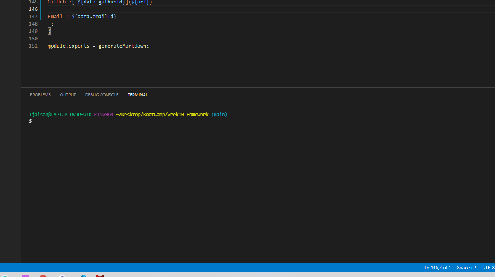

# Readme Generator

## Description
create a command-line application that dynamically generates a professional README.md file from a user's input using the [Inquirer package](https://www.npmjs.com/package/inquirer). Review the [Professional README Guide](https://coding-boot-camp.github.io/full-stack/github/professional-readme-guide)as a reminder of everything that a high-quality, professional README should contain. 
## Table of Contents
- [Installation](#installation)
- [Usage](#usage)
- [Contribution](#contribution)
- [Testing Instructions](#testing-instructions)
- [License](#license)
- [Questions](#questions)
---
## User Story

AS A developer
I WANT a README generator
SO THAT I can quickly create a professional README for a new project

## Acceptance Criteria

GIVEN a command-line application that accepts user input
WHEN I am prompted for information about my application repository
THEN a high-quality, professional README.md is generated with the title of my project and sections entitled Description, Table of Contents, Installation, Usage, License, Contributing, Tests, and Questions
WHEN I enter my project title
THEN this is displayed as the title of the README
WHEN I enter a description, installation instructions, usage information, contribution guidelines, and test instructions
THEN this information is added to the sections of the README entitled Description, Installation, Usage, Contributing, and Tests
WHEN I choose a license for my application from a list of options
THEN a badge for that license is added near the top of the README and a notice is added to the section of the README entitled License that explains which license the application is covered under
WHEN I enter my GitHub username
THEN this is added to the section of the README entitled Questions, with a link to my GitHub profile
WHEN I enter my email address
THEN this is added to the section of the README entitled Questions, with instructions on how to reach me with additional questions
WHEN I click on the links in the Table of Contents
THEN I am taken to the corresponding section of the README

## Installation
You will need to install Node.js and the Inquirer package to run this program.
---
## Usage
The following animation demonstrates the application functionality:

---
## Contribution
No unsolicited contributions can be made at this time.
---
## Testing Instructions
There is no testing script currently.
---
## License
This project is covered under the following license(s):

---
## Questions?
[brijeeta](https://www.github.com/brijeeta)
Email: brijeeta@gmail.com
